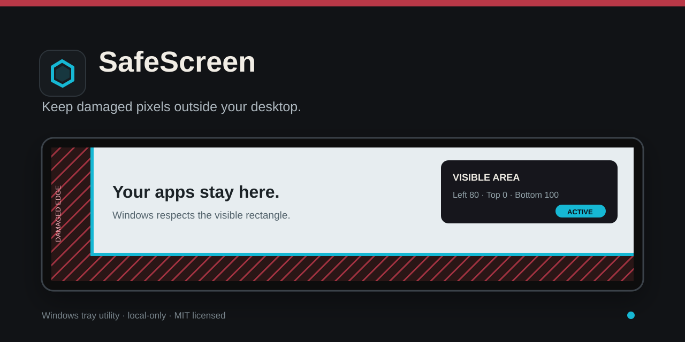

<div align="center">
  
</div>

<div align="center">
  <a href="https://github.com/allthesedreams/safescreen/releases/latest"></a>
  
  <a href="LICENSE"></a>
  <a href="PRIVACY.md"></a>
</div>

SafeScreen is a small Windows tray utility for monitors with damaged edges. It
reserves the broken strips so maximized windows, the desktop, and normal app
layouts stay inside the part of the panel you can still see.

No account. No telemetry. No administrator rights.

<p align="center">
  <a href="https://github.com/allthesedreams/safescreen/releases/latest"><strong>Download the latest release</strong></a>
  ·
  <a href="#quick-start">Quick start</a>
  ·
  <a href="SUPPORT.md">Support</a>
</p>

## What it solves

A cracked LCD can leave the computer usable while hiding the Start button,
taskbar, window controls, or part of every maximized app. Changing resolution
usually scales the picture toward the center. SafeScreen instead tells Windows
that the damaged strips are occupied, keeping the usable desktop pinned to the
visible corner.

## Product features

- Select the usable area directly on the full screen by dragging three edges.
- Keep the right edge pinned for panels damaged on the left or bottom.
- Turn restrictions on or off from the tray without losing the saved area.
- Switch between ready-made profiles or reopen the visual picker.
- Restore the layout after Explorer restarts or display settings change.
- Start with Windows through a visible tray toggle.
- Fall back to a compact visual editor; numeric input is optional.
- Store all settings locally for the current Windows user.

## Quick start

1. Open the [latest release](https://github.com/allthesedreams/safescreen/releases/latest).
2. Download `SafeScreen-v1.4.1-win-x64.zip`.
3. Extract the ZIP into a permanent folder.
4. Run `SafeScreen.exe --install` once, then run `SafeScreen.exe`.
5. Right-click the tray icon and choose **Select area on full screen**.

Double-clicking the tray icon opens the full-screen picker. The **Start with
Windows** tray item controls autostart at any time.

### Picker keyboard controls

- `Enter` — save the selected area.
- `Esc` — cancel.
- `Space` — select the next boundary.
- Arrow keys — move the selected boundary by 5 px.
- `Shift` + arrow keys — move it by 20 px.

## How it works

SafeScreen registers transparent edge bars through the native Windows AppBar
API. Windows subtracts those bars from the desktop working area, so ordinary
maximized windows respect the remaining rectangle. A lightweight watchdog
re-registers the bars when Explorer or the display layout changes.

SafeScreen does not change or repair the monitor hardware.

## Command line

```powershell
.\SafeScreen.exe --install
.\SafeScreen.exe
.\SafeScreen.exe --enable
.\SafeScreen.exe --disable
.\SafeScreen.exe --set 80 0 100
.\SafeScreen.exe --show-settings
.\SafeScreen.exe --stop
.\SafeScreen.exe --uninstall
```

## Build from source

Requirements: Windows and .NET Framework 4.x with the 64-bit C# compiler.

```powershell
.\build.ps1
```

The build embeds the application manifest, icon, and logo into one executable.

## Current limits

- The visual picker currently targets the primary display.
- The right boundary is intentionally fixed to the monitor edge.
- The distributed ZIP is portable rather than an MSI installer.
- Windows may show an unsigned-app warning because the executable is not code-signed.

See the candidate next steps in [ROADMAP.md](ROADMAP.md).

## Trust and privacy

Settings are stored under `HKCU\Software\AWAKE\SafeScreen`. The app makes no
network requests and contains no analytics or advertising. See [PRIVACY.md](PRIVACY.md)
and [SECURITY.md](SECURITY.md).

## Contributing

Bug reports and focused improvements are welcome. Start with
[CONTRIBUTING.md](CONTRIBUTING.md), or use the repository's structured issue
forms for a [bug](https://github.com/allthesedreams/safescreen/issues/new?template=01-bug.yml)
or [feature request](https://github.com/allthesedreams/safescreen/issues/new?template=02-feature.yml).

SafeScreen is available under the [MIT License](LICENSE).
